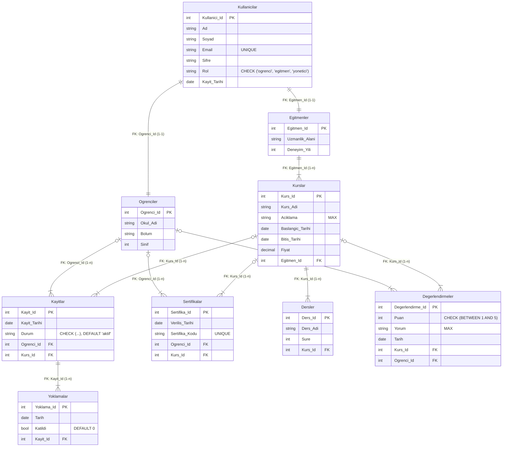

Eğitim Kurs ve Sertifika Takip Sistemi
Fırat Üniversitesi BMU329 Veri Tabanı Sistemleri dersi   5. Grup "Eğitim Kurs ve Sertifika Takip Sistemi" projesidir.

Berçem Papatya-235260071

Tunahan Özdil-235260089

Taha Can Şenel-235260045

Varlıklar ve Nitelikler
1. Kullanıcılar (Kullanicilar)

Sistemdeki tüm kullanıcıları (öğrenci, eğitmen, yönetici) temsil eder.
Nitelikler:
Kullanici_Id, Ad, Soyad, Email, Sifre, Rol, Kayit_Tarihi

2. Öğrenciler (Ogrenciler)

Kullanıcı tablosundaki öğrenci kayıtlarını detaylandırır.
Nitelikler:
Ogrenci_Id, Okul_Adi, Bolum, Sinif

3. Eğitmenler (Egitmenler)

Sistemde ders veren eğitmenleri temsil eder.
Nitelikler:
Egitmen_Id, Uzmanlik_Alani, Deneyim_Yili

4. Kurslar (Kurslar)

Sistemde açılan tüm kursları içerir.
Nitelikler:
Kurs_Id, Kurs_Adi, Aciklama, Egitmen_Id, Baslangic_Tarihi, Bitis_Tarihi, Fiyat

5. Kayıtlar (Kayitlar)

Öğrencilerin kurslara katılım bilgilerini tutar.
Nitelikler:
Kayit_Id, Ogrenci_Id, Kurs_Id, Kayit_Tarihi, Durum

6. Sertifikalar (Sertifikalar)

Tamamlanan kurslar sonrası verilen sertifikaları gösterir.
Nitelikler:
Sertifika_Id, Ogrenci_Id, Kurs_Id, Verilis_Tarihi, Sertifika_Kodu

7. Dersler (Dersler)

Her kursa ait ders içeriklerini tutar.
Nitelikler:
Ders_Id, Kurs_Id, Ders_Adi, Sure

8. Yoklamalar (Yoklamalar)

Öğrencilerin ders katılım durumlarını gösterir.
Nitelikler:
Yoklama_Id, Kayit_Id, Tarih, Katildi

9. Değerlendirmeler (Degerlendirmeler)

Öğrencilerin kurslara verdikleri puan ve yorumları içerir.
Nitelikler:
Degerlendirme_Id, Kurs_Id, Ogrenci_Id, Puan, Yorum, Tarih

  Varlıklar Arasındaki İlişkiler
Kullanıcı – Öğrenci (1–1): Her öğrenci bir kullanıcıya karşılık gelir.

Kullanıcı – Eğitmen (1–1): Her eğitmen bir kullanıcıya karşılık gelir.

Eğitmen – Kurs (1–n): Bir eğitmen birden fazla kurs verebilir.

Kurs – Ders (1–n): Bir kurs birden fazla dersten oluşabilir.

Kurs – Kayıt (1–n): Bir kursa birden fazla öğrenci kayıt olabilir.

Öğrenci – Kayıt (1–n): Bir öğrenci birden fazla kursa kayıt olabilir.

Kayıt – Yoklama (1–n): Her kayıt için birden fazla yoklama tutulabilir.

Kurs – Sertifika (1–n): Kurs tamamlandığında birden fazla sertifika oluşabilir.

Öğrenci – Sertifika (1–n): Bir öğrenci birden fazla sertifika alabilir.

Kurs – Değerlendirme (1–n): Bir kursa birçok değerlendirme yapılabilir.

Öğrenci – Değerlendirme (1–n): Her öğrenci birden fazla kursu değerlendirebilir
